# 基于Springboot的美发门店管理系统

## Springboot-0058


## 技术栈

Springboot mybatisplus vue mysql maven


## 数据库表(16张)


## 功能介绍

```properties
用户功能有项目预定管理，产品购买管理，会员充值管理，余额查询管理。

管理员功能有个人中心，用户管理，美容项目管理，项目类型管理，项目预定管理，产品库存管理，产品购买管理，产品入库管理，会员卡管理，会员充值管理，余额查询管理，产品类型管理，系统管理等。
```


## 图片

### 前台


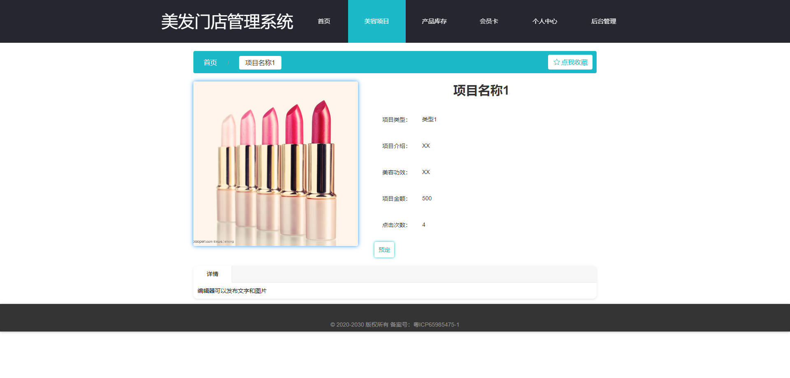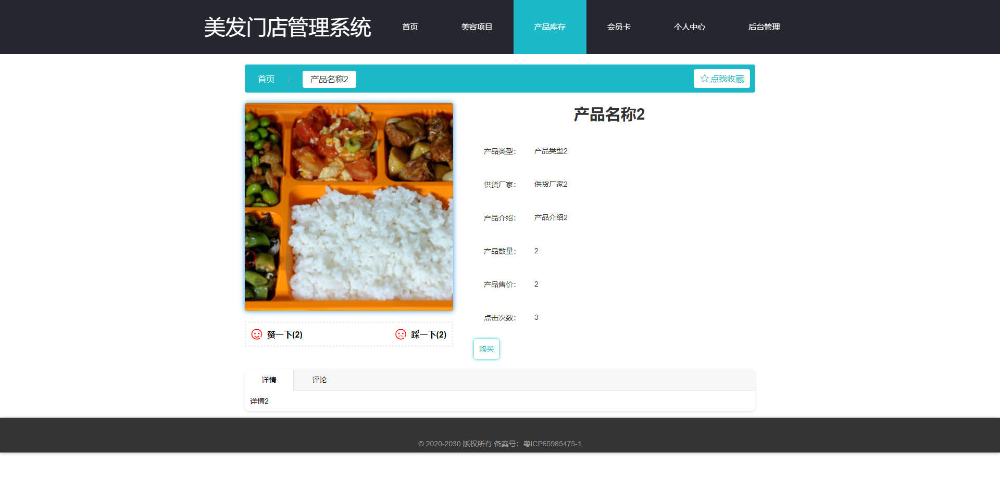

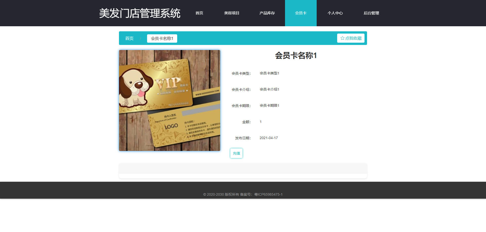

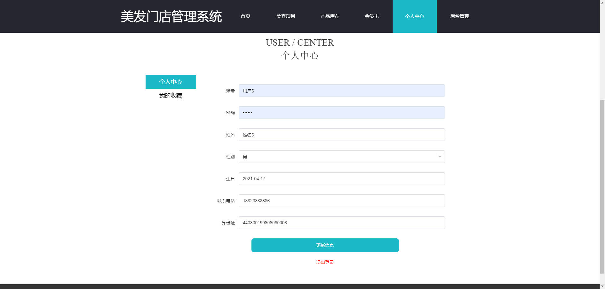

### 后台


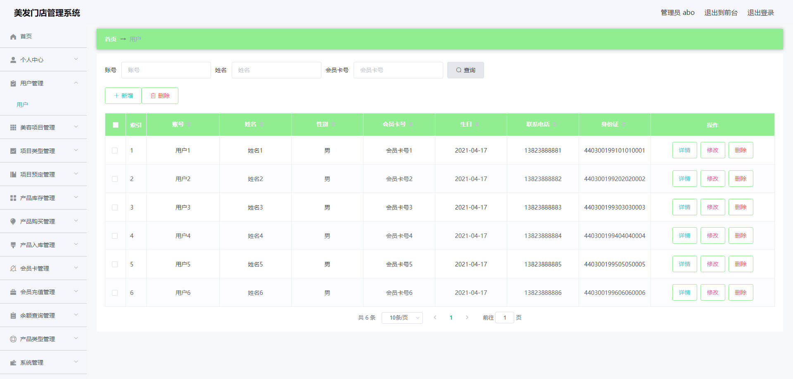

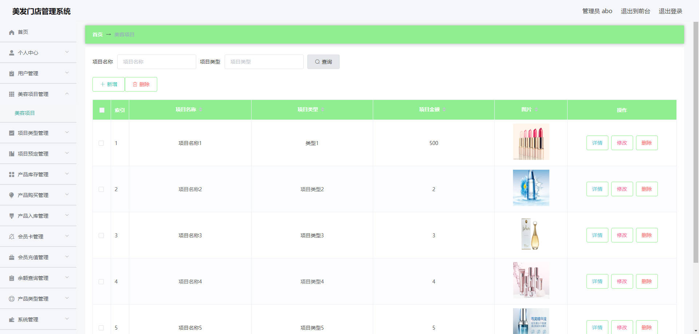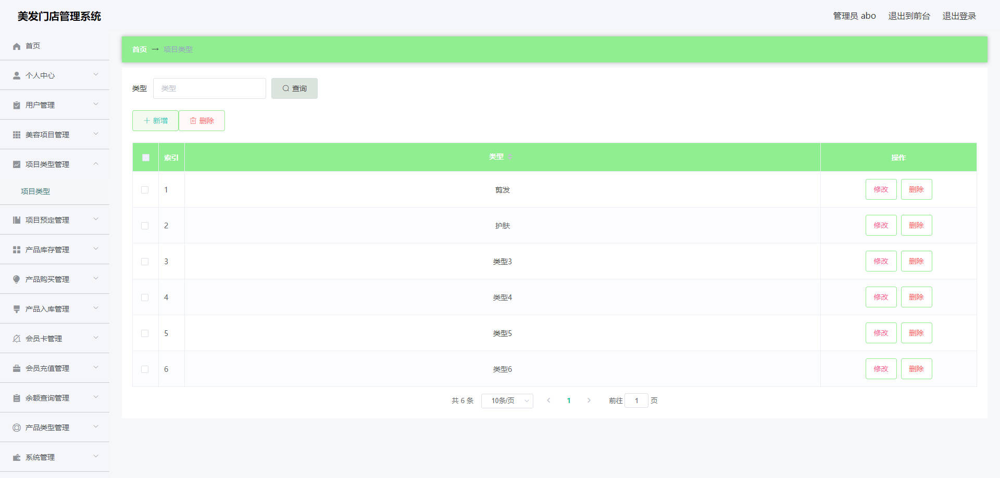

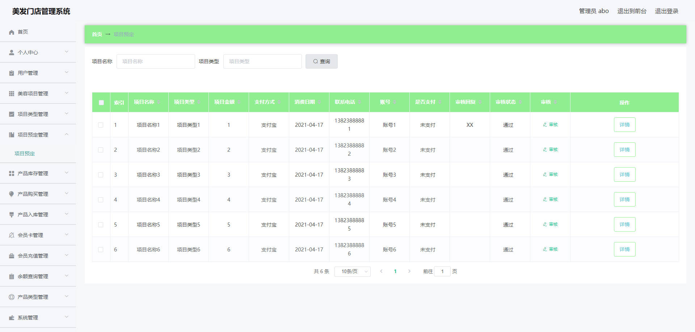

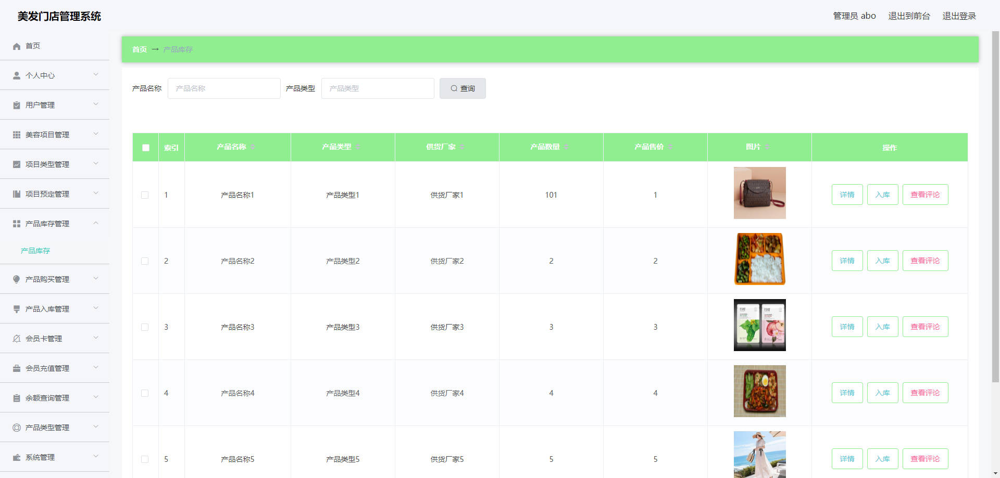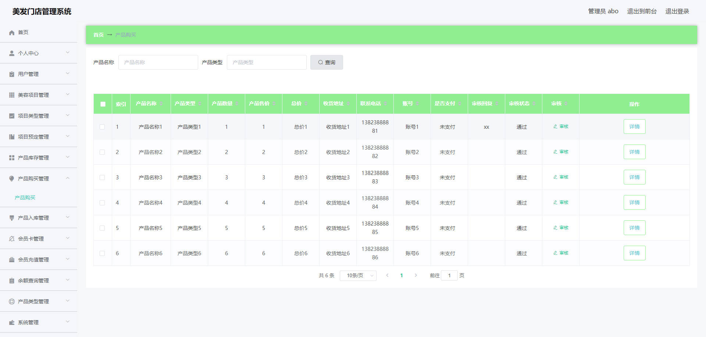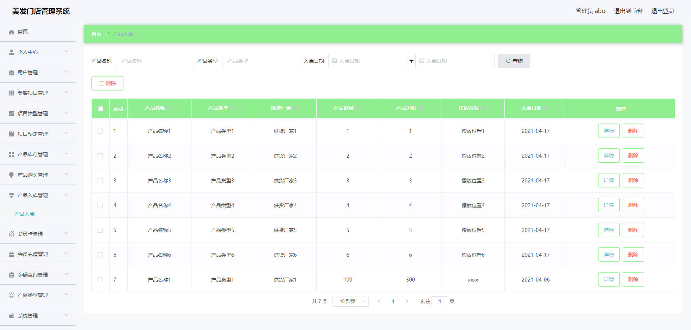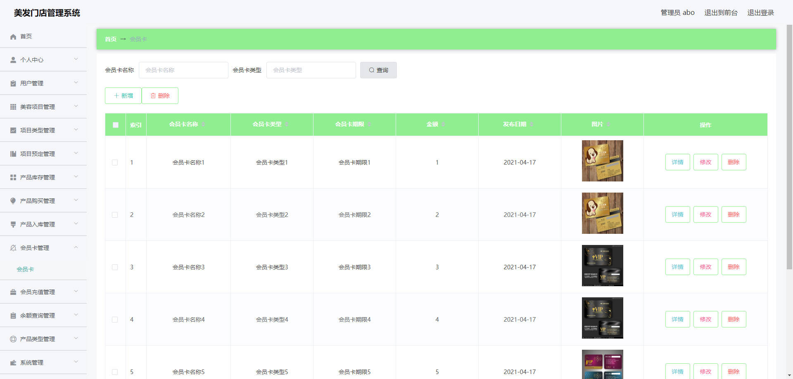

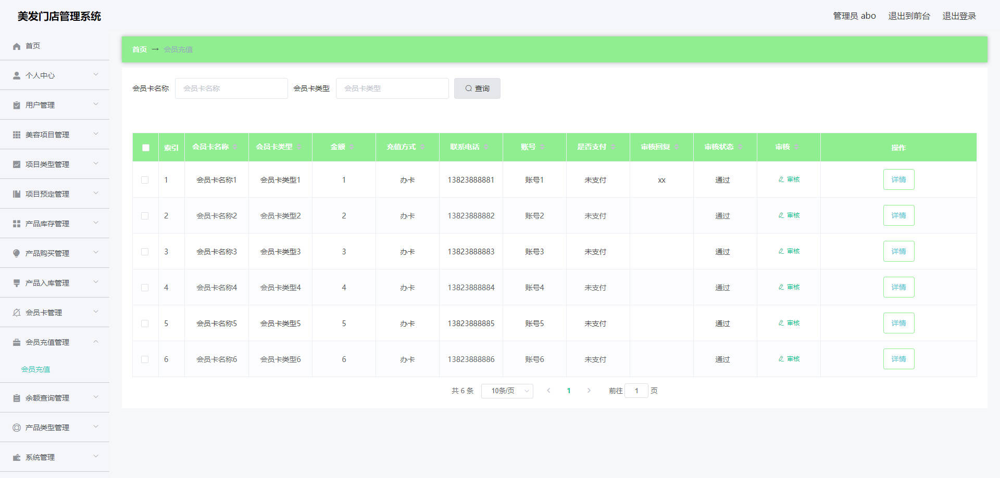

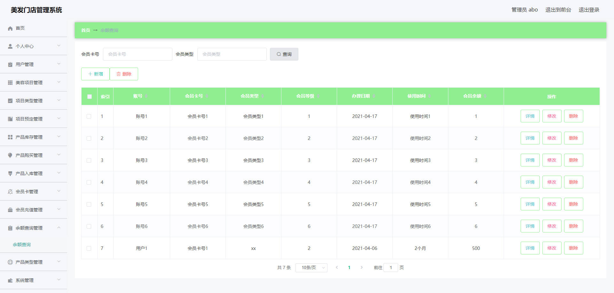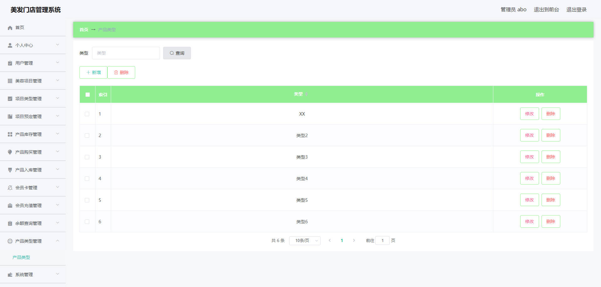


## 访问路径

### 前台

```properties
http://localhost:8080/springbootq9xc1/front/pages/login/login.html

账号 用户6
密码 123456
```

### 后台

```properties
http://localhost:8080/springbootq9xc1/admin/dist/index.html#/login

账号 abo
密码 abo
```


## 功能图

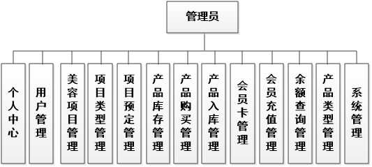

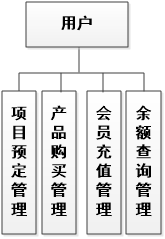

## 文档目录

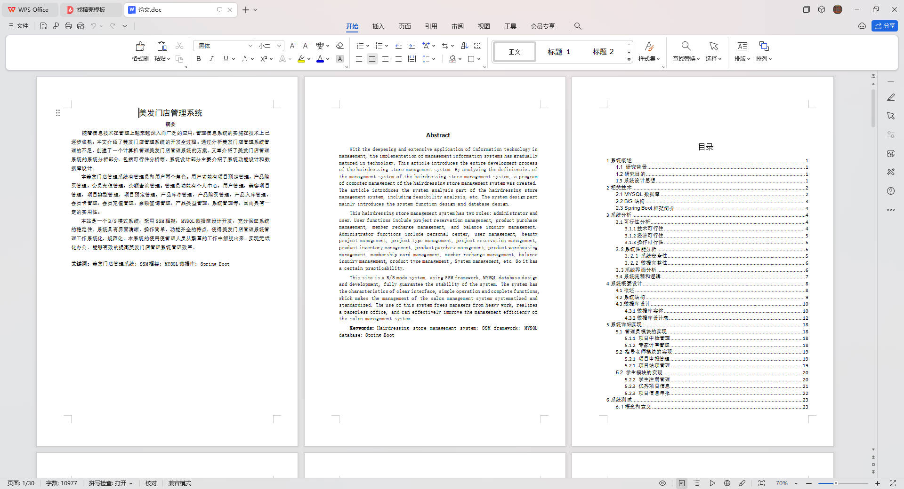


## 打赏或交流


